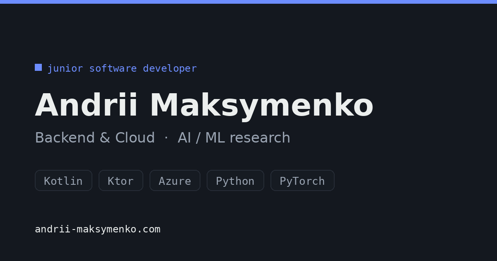
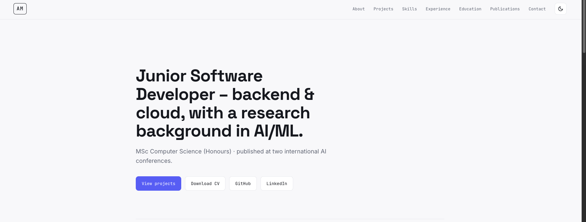
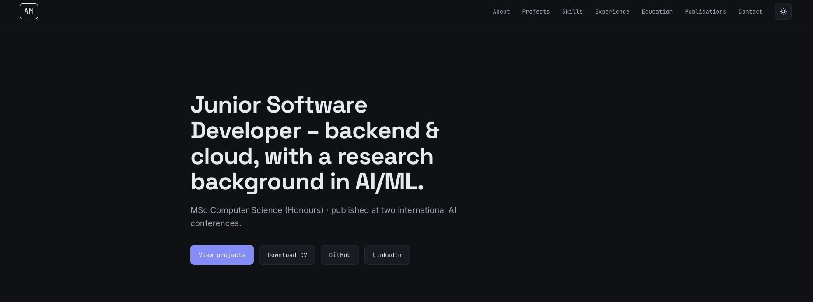

# Andrii Maksymenko – Portfolio



[](https://andrii-maksymenko.com)
[](https://astro.build)
[](https://vercel.com)
[](https://securityheaders.com/?q=https://andrii-maksymenko.com)

Personal portfolio site for **Andrii Maksymenko**, Junior Software Developer (Backend & Cloud, with a research background in AI/ML).

**Live:** [andrii-maksymenko.com](https://andrii-maksymenko.com)

## About

A single-page portfolio covering projects, skills, experience, education, and publications – built to showcase backend/cloud engineering work (a deployed Kotlin/Ktor REST API on Azure) alongside AI/ML research (a hybrid reinforcement-learning agent presented at two international conferences).

## Preview

| Light mode | Dark mode |
|---|---|
|  |  |

## Tech stack

- **[Astro](https://astro.build)** – static site generation, near-zero shipped JavaScript
- Plain CSS with custom properties (no framework) – light/dark theme via CSS variables
- Vanilla JS for the dark-mode toggle and project category filter, loaded as external scripts

## Features

- **Dark mode** – toggle in the header, remembers your choice, respects system preference on first visit
- **Project filtering** – filter the project grid by category (Backend, AI/ML, Mobile, Games) with an animated crossfade
- **Security headers** – strict Content-Security-Policy, HSTS, and related headers via `vercel.json`
- **Downloadable CV** – phone-free public version, linked from the hero
- **Fast by default** – static output, system fonts fallback, zero JS framework runtime

## Project structure

```
├── public/
│   ├── AndriiMaksymenko_CV_EN.pdf   # public (no-phone) CV, linked from the site
│   ├── favicon.svg
│   ├── og.png                       # social share preview image
│   ├── theme-init.js                # sets theme before first paint
│   ├── theme-toggle.js              # dark/light toggle handler
│   └── projects-filter.js           # project category filter logic
├── src/
│   └── pages/
│       └── index.astro              # entire site: content, markup, styles
├── astro.config.mjs
└── vercel.json                      # security headers
```

All page content (projects, skills, experience, education, publications) lives in plain arrays at the top of `src/pages/index.astro` – no CMS, no database.

## Running locally

Requires [Node.js](https://nodejs.org) 18+.

```bash
npm install
npm run dev       # http://localhost:4321
```

```bash
npm run build     # production build → ./dist
npm run preview   # preview the production build
```

## Deployment

Deployed on [Vercel](https://vercel.com), connected to this repository – every push to `main` triggers an automatic rebuild. DNS is managed on a custom domain via Porkbun.

## Contact

- Portfolio: [andrii-maksymenko.com](https://andrii-maksymenko.com)
- LinkedIn: [linkedin.com/in/andrii-maksymenko](https://www.linkedin.com/in/andrii-maksymenko-83628932a/)
- GitHub: [@defoltbl](https://github.com/defoltbl)
