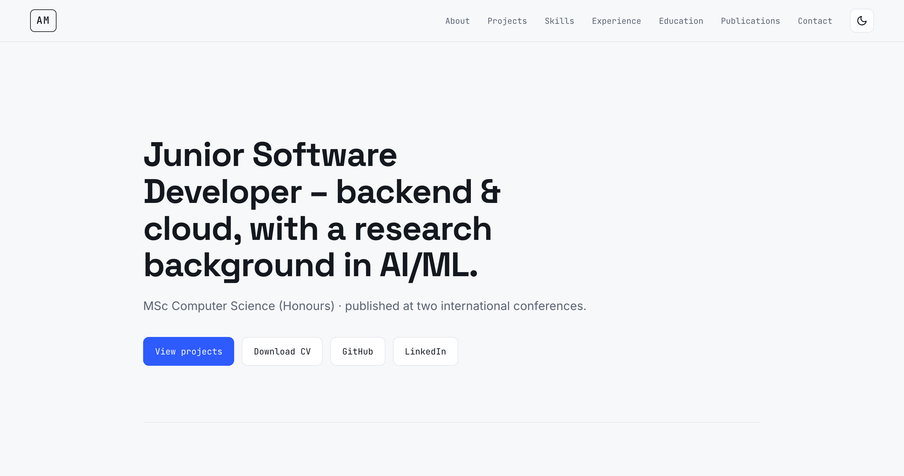
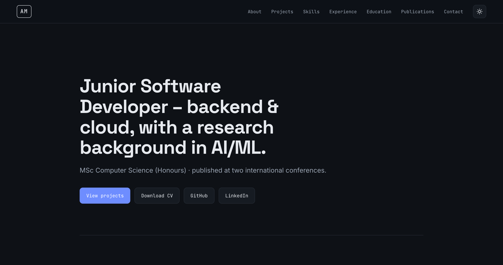
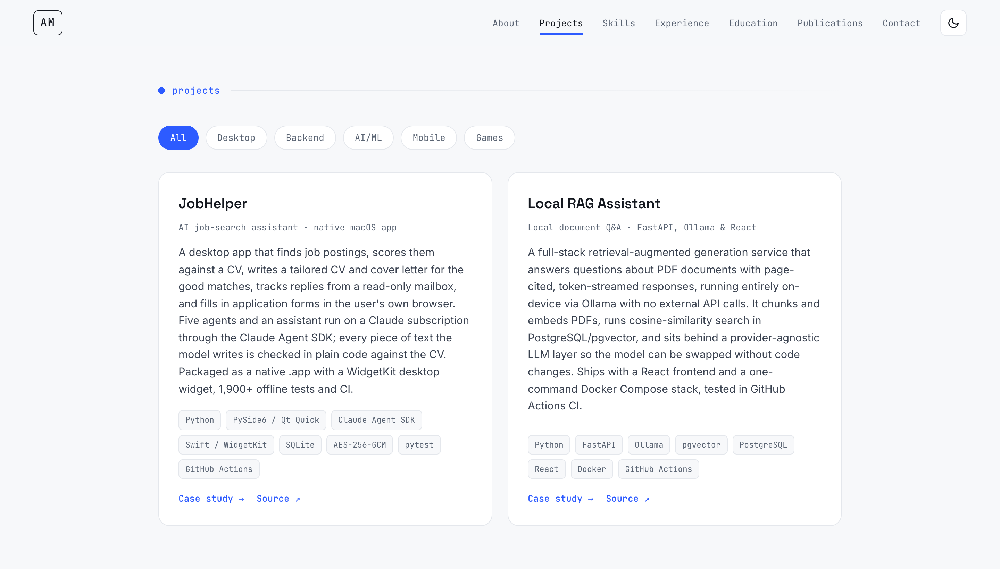
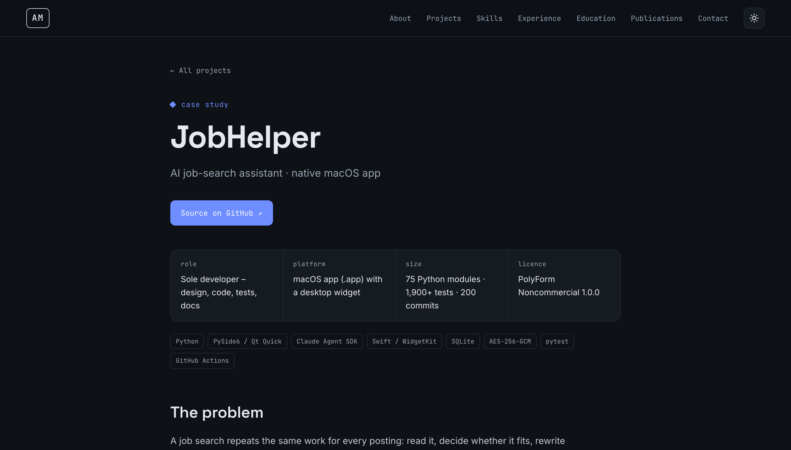
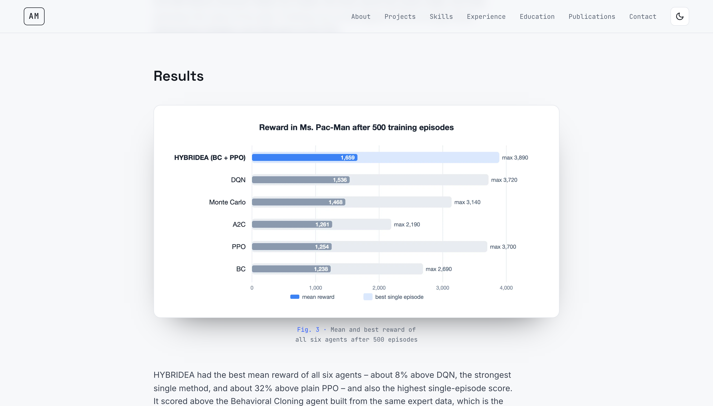

# Andrii Maksymenko – Portfolio


[](https://andrii-maksymenko.com)
[](https://astro.build)
[](https://vercel.com)
[](https://github.com/defoltbl/portfolio/actions/workflows/ci.yml)
[](https://securityheaders.com/?q=https://andrii-maksymenko.com)

Personal portfolio site for **Andrii Maksymenko**, Junior Software Developer (Backend & Cloud, with a research background in AI/ML).

**Live:** [andrii-maksymenko.com](https://andrii-maksymenko.com)

## About

A portfolio with a case-study page for every project – built to show how the work was done, not
only what it is: the problem, the key decisions, the engineering, and diagrams of how each system
works. Six projects: a native macOS AI app (JobHelper), a local RAG assistant, a Kotlin/Ktor REST
API deployed on Azure, a hybrid RL/IL game-AI agent presented at two international conferences
(HYBRIDEA), an Android finance app and a 2D game in Python.

## Preview

| Light mode | Dark mode |
|---|---|
|  |  |
|  |  |



## Tech stack

- **[Astro 7](https://astro.build)** – static site generation, near-zero shipped JavaScript
- **Content collections** – one Markdown file per project, validated by a Zod schema at build time
- **TypeScript** (strict) for data and scripts; `astro check` in CI
- Plain CSS with custom properties – light/dark theme via CSS variables
- Astro page transitions (`ClientRouter`), the View Transitions API for the project filter, and a small IntersectionObserver script for scroll reveals
- A small rehype plugin that turns case-study images into framed, numbered figures

## Features

- **Case studies for every project** – the problem, key decisions and engineering, with key facts at the top and a link to the source
- **Sharp, framed figures** – screenshots in a window frame, diagrams on a white card, each with a numbered caption (*Fig. 1 · …*); screenshots and diagrams are drawn at 2x for Retina and 4K screens
- **Subtle motion** – page transitions, scroll reveals and a sticky top bar that marks the section being read; nothing blinks on the way back, and all of it switches off with *reduce motion*
- **Dark mode** – remembers the choice, follows the system preference on first visit, and stays the same colour through every page transition
- **Project filtering** – by category, in one short motion: cards that stay glide to their new places, new ones fade in
- **Security headers** – strict Content-Security-Policy (no inline scripts), HSTS and related headers via `vercel.json`
- **Checked before it ships** – `npm run verify` type-checks, builds, and fails on an inline script, a broken link or anchor, an image without alt text, or a page without title or description; a headless-Chrome check then plays the page transitions and the project filter frame by frame and fails on any blink

## Project structure

```
├── public/
│   ├── AndriiMaksymenko_CV_EN.pdf   # public (no-phone) CV, linked from the site
│   ├── favicon.svg, og.png          # icon and social share preview
│   └── theme-init.js                # sets the theme before first paint and before each page swap
├── src/
│   ├── content/projects/*.md        # one file per project; case studies are the Markdown body
│   ├── content.config.ts            # the project schema (Zod)
│   ├── data/profile.ts              # contact, skills, experience, education, publications (typed)
│   ├── layouts/Base.astro           # head, meta tags, top bar, footer, page transitions
│   ├── components/                  # Header, Footer, ProjectCard, Timeline, SectionHead
│   ├── pages/index.astro            # home page
│   ├── pages/projects/[id].astro    # case study pages
│   ├── scripts/                     # theme switch, project filter, motion (TypeScript)
│   ├── plugins/rehype-figures.mjs   # images in case studies → framed, numbered figures
│   ├── styles/global.css
│   └── assets/<project>/            # screenshots and diagrams (optimised at build)
├── scripts/check-dist.mjs           # checks the built pages
├── scripts/check-motion.mjs         # checks transitions and the filter frame by frame
├── .github/workflows/ci.yml         # verify on every push and pull request
├── docs/                            # README screenshots (not deployed)
├── astro.config.mjs                 # scripts are never inlined (CSP)
└── vercel.json                      # security headers
```

To add a project, add a Markdown file to `src/content/projects/`; with `caseStudy: true`, its body
becomes a page at `/projects/<file name>/`, and its `facts` show as the key-facts row at the top.

An image on a line of its own becomes a figure; its alt text is the caption, and its title picks
the frame:

```markdown
       <!-- window frame -->
  <!-- white card -->
      <!-- own size, centred -->
```

## Running locally

Requires [Node.js](https://nodejs.org) 22.22 or newer.

```bash
npm install
npm run dev       # http://localhost:4321
npm run verify    # type check, production build, built-site and motion checks
npm run preview   # preview the production build
```

## Deployment

Deployed on [Vercel](https://vercel.com), connected to this repository – every push to `main` triggers an automatic rebuild. DNS is managed on a custom domain via Porkbun.

## Contact

- Portfolio: [andrii-maksymenko.com](https://andrii-maksymenko.com)
- LinkedIn: [linkedin.com/in/andrii-maksymenko](https://www.linkedin.com/in/andrii-maksymenko-83628932a/)
- GitHub: [@defoltbl](https://github.com/defoltbl)
